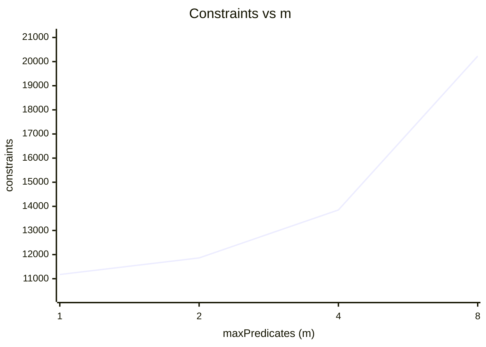
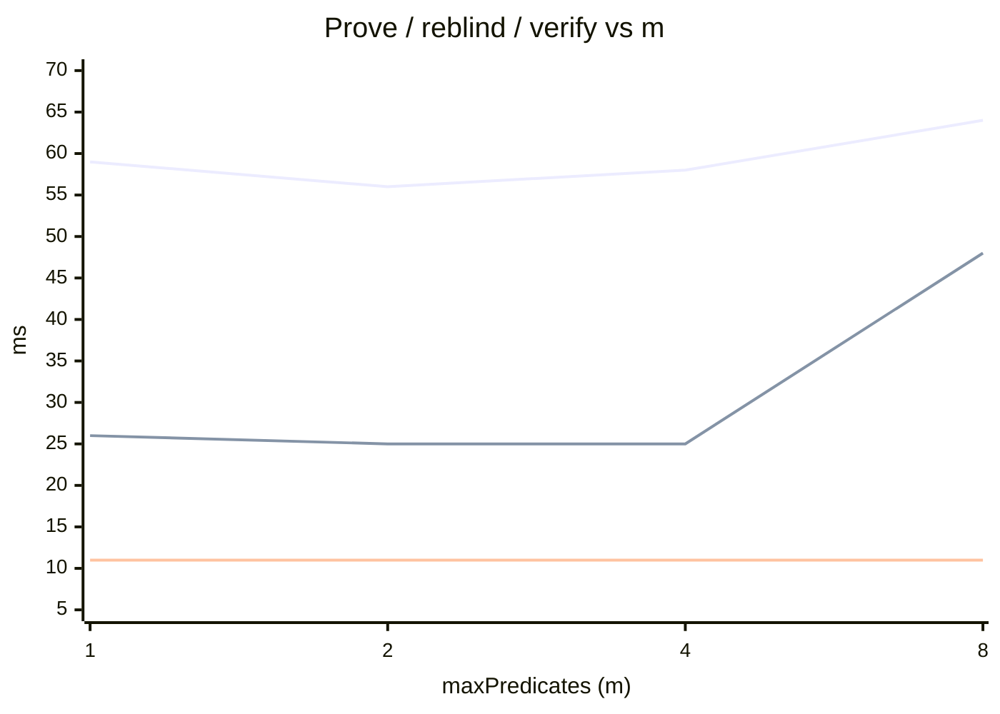
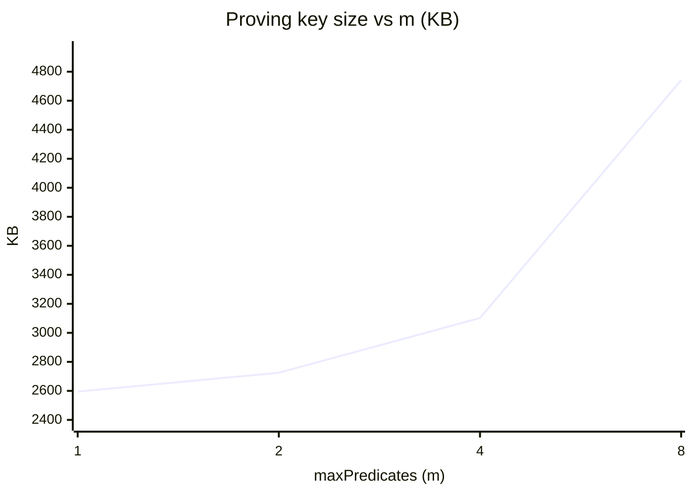
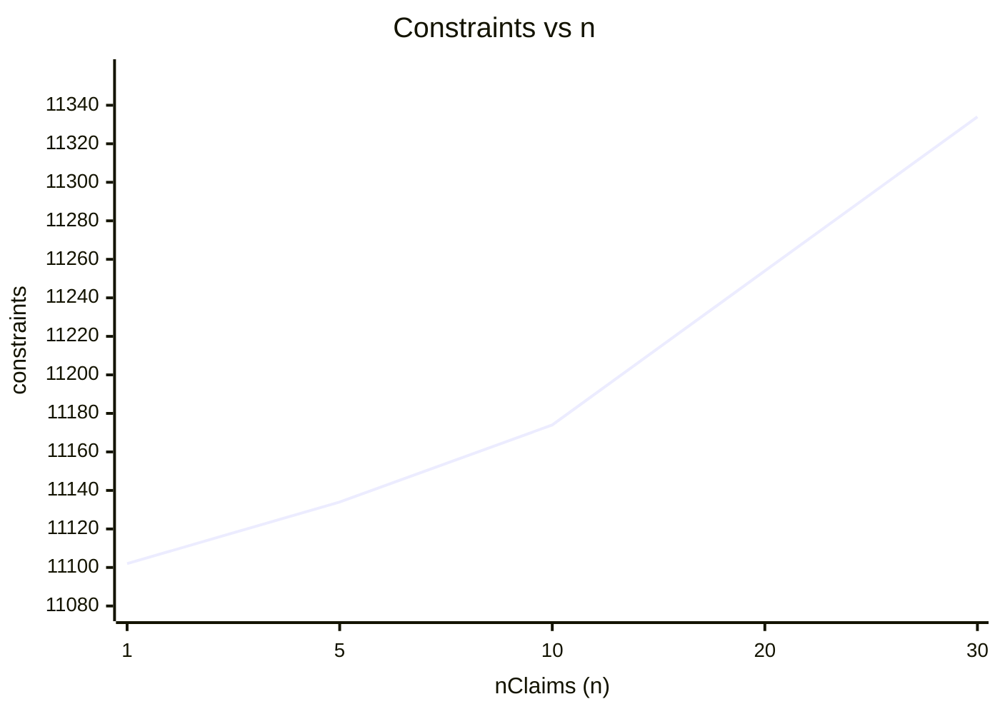
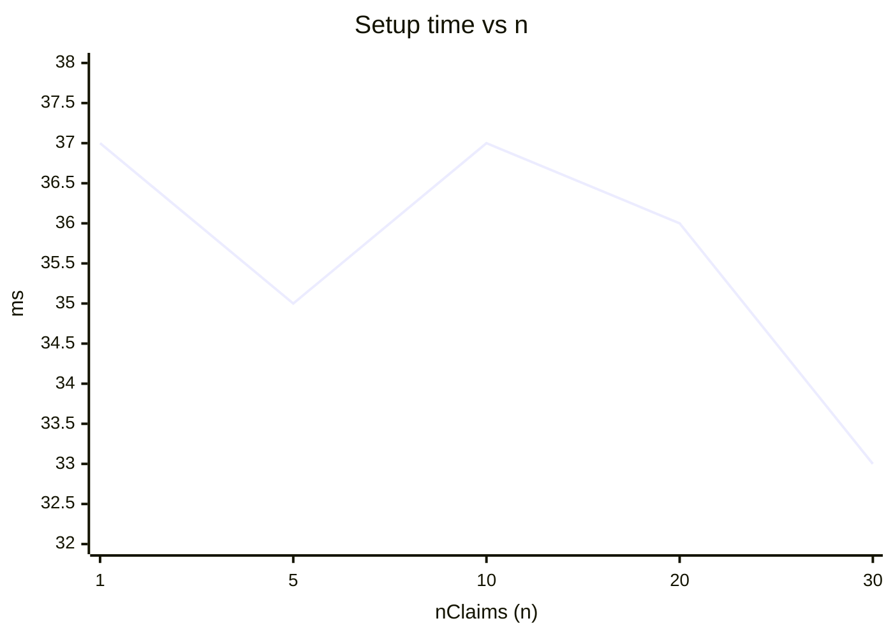
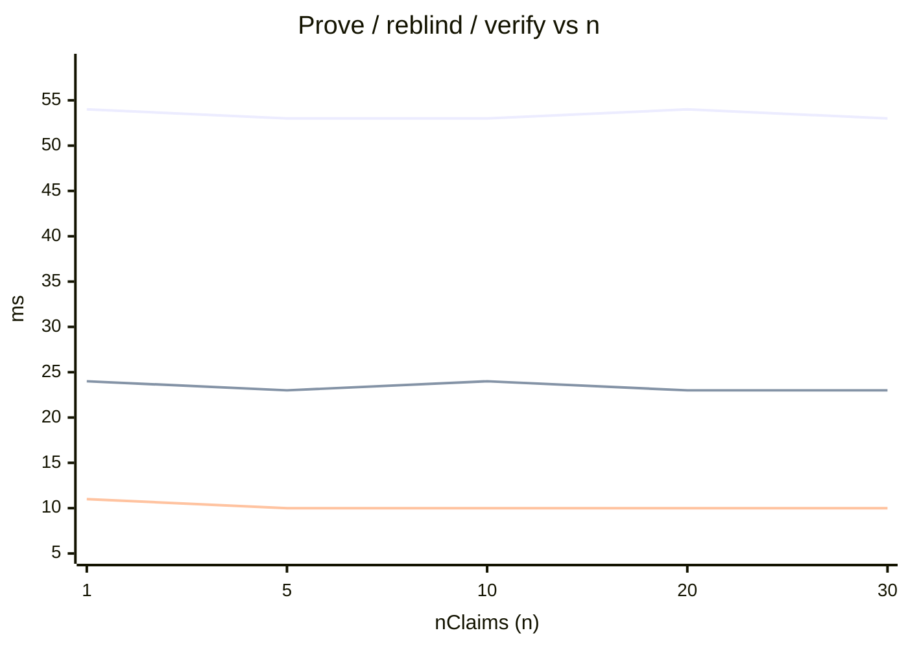
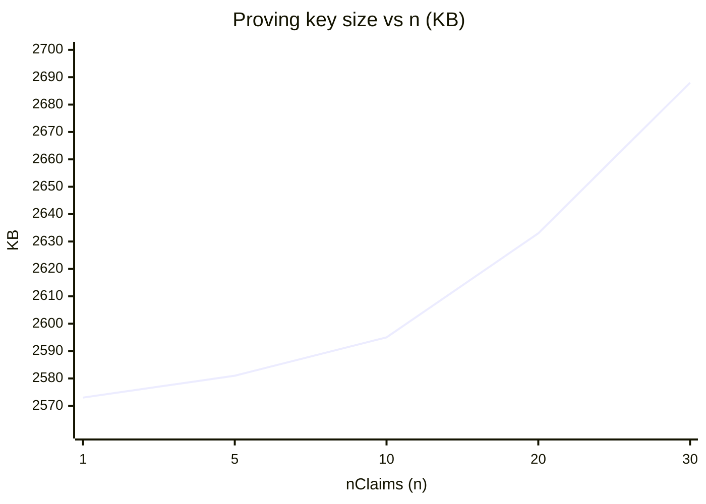

# Show-circuit benchmarks: full report

Combined results across **12/12** configurations from `circom/benchmarks/configs.json`. Each row is a separate compilation of `Show(nClaims, maxPredicates, maxLogicTokens, 64)`; `predicateLen` and `exprLen` equal `maxPredicates` and `maxLogicTokens` respectively, so the circuit is sized exactly to its workload.

Generated by `scripts/benchmarks/generate-report.ts`. Re-run after both `yarn bench:constraints` and `ecdsa-spartan2/benchmarks/scripts/run-show-bench.sh` to refresh.

**Sweeps**

| Sweep | Variable | Held fixed |
| --- | --- | --- |
| `predicates_at_n10` | `m ∈ {1, 2, 4, 8}` (left-deep AND chain, `t = 2m - 1`) | `n = 10` |
| `claims_at_m1`      | `n ∈ {1, 5, 10, 20, 30}`                              | `m = 1, t = 1` |
| `operator_mix`      | `predicateOp ∈ {==, ≤}`                                | `n = 10, m = 4, t = 7` |
| `rhs_kind`          | RHS kind (literal vs claim reference)                  | `n = 10, m = 4, t = 7` |

## Takeaways

1. **Predicates dominate constraints.** Each extra predicate adds about **1293 constraints** in the m-sweep, while each extra claim only adds about **8** in the n-sweep. The ECDSA verification dominates the absolute baseline (about 11,174 constraints with the smallest workload), so the variable predicate/claim cost rides on top of a large fixed cost.
2. **The m-slope bundles three effects, not just per-predicate cost.** The canonical expression is a left-deep AND chain (`P0 P1 AND P2 AND ...`), so going from m to m+1 adds *two* postfix tokens: one new predicate ref and one `AND` operator. The reported per-predicate slope therefore charges the prover for (1) one more comparison in `EvalPredicates`, (2) one more REF step, and (3) one more AND step in the postfix evaluator. To isolate per-token cost alone, hold m fixed and grow t with idempotent inserts (e.g. pairs of `NOT NOT`).
3. **`==` and `<=` produce the same R1CS** (confirmed). The circuit handles all operators uniformly, so operator mix is a runtime concern only. The witness has to satisfy bit-decomposition for `<=` regardless of how the proof is generated. In the timing data the prove-time delta between `<=` and `==` was **0.0%** (relative to ==).
4. **Claim-to-claim references cost the same R1CS as constant operands** (confirmed). Both the literal RHS and the claim-mux RHS go through the same multiplexer, so the circuit is paying for both either way. Prove-time delta vs. literal-RHS baseline: **-5.2%**.
5. **Reblind is roughly 0.43x the cost of prove** at the baseline configuration (25 ms vs 58 ms), because reblinding only re-randomizes commitments to the shared witness rows. It does not redo the full proving work. This makes presentations cheap to refresh.
   Reblind is *not* perfectly flat across m, though: it jumps from 26 ms at m=1 to 48 ms at m=8 (a 84.6% increase). The shared layout itself does not change with m (it is always `[deviceKeyX, deviceKeyY, claimValues[..n]]`), so this jump comes from the larger Spartan circuit underneath, likely an MSM batch crossing a threshold.
6. **Proof size and verify time grow much slower than prove time.** Across the m-sweep proof size moved by **2.5%** and verify time by **0.0%**, while constraints grew by about 81.0%. This is the usual Spartan pattern: prover-side work scales with the circuit, verifier-side work is closer to logarithmic.
7. **The proving key dominates the size budget.** At the baseline, pk = 3.03 MB vs proof = 40.51 KB, so pk is roughly 77x the proof. Mobile deployments need to think about pk delivery; the per-presentation network cost (proof + reblinded proof) is small.
8. **Witness generation is essentially flat** at 7 to 11 ms across every configuration. `witnesscalc` cost is dominated by ECDSA, not by the predicate/expression workload, so packing more predicates into a presentation does not move this number.
9. **Adding claim slots is almost free.** Going from n=1 to n=30 costs only about 8 constraints per claim and the timing/size impact is below measurement noise. Practical credentials with 20 to 30 claim fields are not the bottleneck. The predicate count is.

## Constraints

Per-configuration R1CS constraint counts (`circom -p secq256r1 --O2`). `predicateLen` and `exprLen` are sized exactly to the workload, so no inactive padding is counted.

### Sweep: `predicates_at_n10`

| name | n | m | t | op | rhsRef | expression | constraints | wires | labels |
| --- | ---: | ---: | ---: | --- | :---: | --- | ---: | ---: | ---: |
| S1_m1_n10 | 10 | 1 | 1 | le | no | `P0` | 11,174 | 11,157 | 24,769 |
| S1_m2_n10 | 10 | 2 | 3 | le | no | `P0 P1 AND` | 11,862 | 11,814 | 26,101 |
| S1_m4_n10 | 10 | 4 | 7 | le | no | `P0 P1 AND P2 AND P3 AND` | 13,850 | 13,716 | 30,109 |
| S1_m8_n10 | 10 | 8 | 15 | le | no | `P0 P1 AND P2 AND P3 AND P4 AND P5 AND P6 AND P7 AND` | 20,226 | 19,824 | 43,501 |

### Sweep: `claims_at_m1`

| name | n | m | t | op | rhsRef | expression | constraints | wires | labels |
| --- | ---: | ---: | ---: | --- | :---: | --- | ---: | ---: | ---: |
| S2_n1_m1 | 1 | 1 | 1 | le | no | `P0` | 11,102 | 11,076 | 24,562 |
| S2_n5_m1 | 5 | 1 | 1 | le | no | `P0` | 11,134 | 11,112 | 24,654 |
| S2_n10_m1 | 10 | 1 | 1 | le | no | `P0` | 11,174 | 11,157 | 24,769 |
| S2_n20_m1 | 20 | 1 | 1 | le | no | `P0` | 11,254 | 11,247 | 24,999 |
| S2_n30_m1 | 30 | 1 | 1 | le | no | `P0` | 11,334 | 11,337 | 25,229 |

### Sweep: `operator_mix`

| name | n | m | t | op | rhsRef | expression | constraints | wires | labels |
| --- | ---: | ---: | ---: | --- | :---: | --- | ---: | ---: | ---: |
| OP_eq_n10_m4 | 10 | 4 | 7 | eq | no | `P0 P1 AND P2 AND P3 AND` | 13,850 | 13,716 | 30,109 |
| OP_le_n10_m4 | 10 | 4 | 7 | le | no | `P0 P1 AND P2 AND P3 AND` | 13,850 | 13,716 | 30,109 |

### Sweep: `rhs_kind`

| name | n | m | t | op | rhsRef | expression | constraints | wires | labels |
| --- | ---: | ---: | ---: | --- | :---: | --- | ---: | ---: | ---: |
| REF_claim_n10_m4 | 10 | 4 | 7 | le | yes | `P0 P1 AND P2 AND P3 AND` | 13,850 | 13,716 | 30,109 |

## Timings (ms)

Wall-clock milliseconds for each stage of one Show presentation. `setup` runs the universal proving-key derivation; `witness_gen` is `witnesscalc` time on the input JSON; `prove` is proving only (witness pre-warmed, so it does not include witnesscalc); `reblind` re-randomizes the proof under fresh blinding factors (matches production split-R1CS layout `[deviceKeyX, deviceKeyY, claimValues[..n]]`); `verify` checks the reblinded proof.

### Sweep: `predicates_at_n10`

| name | n | m | t | op | rhsRef | setup | witness | prove | reblind | verify |
| --- | ---: | ---: | ---: | --- | :---: | ---: | ---: | ---: | ---: | ---: |
| S1_m1_n10 | 10 | 1 | 1 | le | no | 37 ms | 10 ms | 59 ms | 26 ms | 11 ms |
| S1_m2_n10 | 10 | 2 | 3 | le | no | 41 ms | 8 ms | 56 ms | 25 ms | 11 ms |
| S1_m4_n10 | 10 | 4 | 7 | le | no | 41 ms | 9 ms | 58 ms | 25 ms | 11 ms |
| S1_m8_n10 | 10 | 8 | 15 | le | no | 57 ms | 11 ms | 64 ms | 48 ms | 11 ms |

### Sweep: `claims_at_m1`

| name | n | m | t | op | rhsRef | setup | witness | prove | reblind | verify |
| --- | ---: | ---: | ---: | --- | :---: | ---: | ---: | ---: | ---: | ---: |
| S2_n1_m1 | 1 | 1 | 1 | le | no | 37 ms | 7 ms | 54 ms | 24 ms | 11 ms |
| S2_n5_m1 | 5 | 1 | 1 | le | no | 35 ms | 7 ms | 53 ms | 23 ms | 10 ms |
| S2_n10_m1 | 10 | 1 | 1 | le | no | 37 ms | 7 ms | 53 ms | 24 ms | 10 ms |
| S2_n20_m1 | 20 | 1 | 1 | le | no | 36 ms | 7 ms | 54 ms | 23 ms | 10 ms |
| S2_n30_m1 | 30 | 1 | 1 | le | no | 33 ms | 7 ms | 53 ms | 23 ms | 10 ms |

### Sweep: `operator_mix`

| name | n | m | t | op | rhsRef | setup | witness | prove | reblind | verify |
| --- | ---: | ---: | ---: | --- | :---: | ---: | ---: | ---: | ---: | ---: |
| OP_eq_n10_m4 | 10 | 4 | 7 | eq | no | 40 ms | 8 ms | 56 ms | 23 ms | 10 ms |
| OP_le_n10_m4 | 10 | 4 | 7 | le | no | 42 ms | 8 ms | 56 ms | 23 ms | 10 ms |

### Sweep: `rhs_kind`

| name | n | m | t | op | rhsRef | setup | witness | prove | reblind | verify |
| --- | ---: | ---: | ---: | --- | :---: | ---: | ---: | ---: | ---: | ---: |
| REF_claim_n10_m4 | 10 | 4 | 7 | le | yes | 41 ms | 10 ms | 55 ms | 23 ms | 12 ms |

## Sizes

Bincode-serialized byte counts of the in-memory artifacts. `proof` is the initial Spartan proof; `reblinded` is the proof a verifier actually receives. `pk` and `vk` are the proving / verifying keys.

### Sweep: `predicates_at_n10`

| name | n | m | t | proof | reblinded | pk | vk | witness |
| --- | ---: | ---: | ---: | ---: | ---: | ---: | ---: | ---: |
| S1_m1_n10 | 10 | 1 | 1 | 40.51 KB | 40.51 KB | 2.53 MB | 2594.78 KB | 512.52 KB |
| S1_m2_n10 | 10 | 2 | 3 | 40.51 KB | 40.51 KB | 2.66 MB | 2725.40 KB | 512.52 KB |
| S1_m4_n10 | 10 | 4 | 7 | 40.51 KB | 40.51 KB | 3.03 MB | 3102.12 KB | 512.52 KB |
| S1_m8_n10 | 10 | 8 | 15 | 41.51 KB | 41.51 KB | 4.63 MB | 4742.06 KB | 1025.02 KB |

### Sweep: `claims_at_m1`

| name | n | m | t | proof | reblinded | pk | vk | witness |
| --- | ---: | ---: | ---: | ---: | ---: | ---: | ---: | ---: |
| S2_n1_m1 | 1 | 1 | 1 | 40.51 KB | 40.51 KB | 2.51 MB | 2573.33 KB | 512.52 KB |
| S2_n5_m1 | 5 | 1 | 1 | 40.51 KB | 40.51 KB | 2.52 MB | 2581.30 KB | 512.52 KB |
| S2_n10_m1 | 10 | 1 | 1 | 40.51 KB | 40.51 KB | 2.53 MB | 2594.78 KB | 512.52 KB |
| S2_n20_m1 | 20 | 1 | 1 | 40.51 KB | 40.51 KB | 2.57 MB | 2633.45 KB | 512.52 KB |
| S2_n30_m1 | 30 | 1 | 1 | 40.51 KB | 40.51 KB | 2.62 MB | 2687.74 KB | 512.52 KB |

### Sweep: `operator_mix`

| name | n | m | t | proof | reblinded | pk | vk | witness |
| --- | ---: | ---: | ---: | ---: | ---: | ---: | ---: | ---: |
| OP_eq_n10_m4 | 10 | 4 | 7 | 40.51 KB | 40.51 KB | 3.03 MB | 3102.12 KB | 512.52 KB |
| OP_le_n10_m4 | 10 | 4 | 7 | 40.51 KB | 40.51 KB | 3.03 MB | 3102.12 KB | 512.52 KB |

### Sweep: `rhs_kind`

| name | n | m | t | proof | reblinded | pk | vk | witness |
| --- | ---: | ---: | ---: | ---: | ---: | ---: | ---: | ---: |
| REF_claim_n10_m4 | 10 | 4 | 7 | 40.51 KB | 40.51 KB | 3.03 MB | 3102.12 KB | 512.52 KB |

## Charts

All charts use Mermaid `xychart-beta` (rendered inline on GitHub). When two series share a chart, the order is given below the block.

### Sweep `predicates_at_n10`: varying `m` (n = 10, t = 2m - 1)

**Constraints**



**Setup time**

```mermaid
xychart-beta
    title "Setup time vs m"
    x-axis "maxPredicates (m)" [1, 2, 4, 8]
    y-axis "ms" 35 --> 59
    line [37, 41, 41, 57]
```

**Prove + reblind + verify**



Series (in order): **prove**, **reblind**, **verify**

**Proving key size**



### Sweep `claims_at_m1`: varying `n` (m = 1, t = 1)

**Constraints**



**Setup time**



**Prove + reblind + verify**



Series (in order): **prove**, **reblind**, **verify**

**Proving key size**


